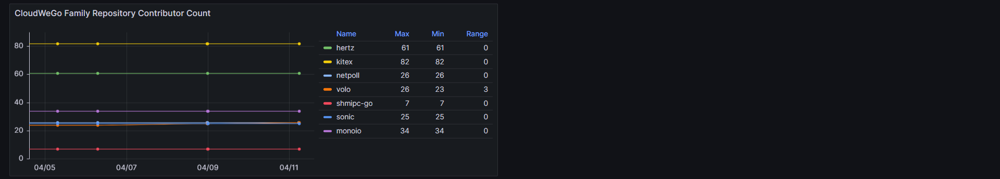

OPENALYSIS 是一款对 GitHub 开源社区的数据进行可视化和分析的工具。

## 概览

OPENALYSIS 只做了三件事：

1. 设置定时任务通过 GitHub API ([REST API](https://docs.github.com/en/rest?apiVersion=2022-11-28) 和 [GraphQL API](https://docs.github.com/en/graphql)) 获取配置的组织或者仓库的数据；
2. 将获取的数据整理并存储在 [MySQL](https://www.mysql.com/) 数据库中；
3. 通过 [Grafana](https://grafana.com/grafana/) 查询数据库并将数据可视化为图表等形式；

OPENALYSIS 提供了：

- 一系列动态的 Grafana Dashboard 来对配置的组织，仓库，贡献者等不同维度的数据进行可视化和分析；
- 一个命令行工具来快速启动和重启定时任务；
- 一系列 API 来配置和使用这个工具；

OPENALYSIS 可以让您对您所管理的或所在的开源社区的整体数据有一个概览，我们希望 OPENALYSIS 可以帮助您更好的对开源社区进行建设和发展。

## 部署

## 使用

## Dashboard Effect Display

## 博客

- [如何对开源社区的数据进行可视化分析](https://juejin.cn/post/7359882185362948135)

## 致谢

Sincere appreciation to the [CloudWeGo](https://github.com/cloudwego) community, without whose help this project would not have been possible.

## 许可证

OPENALYSIS is distributed under the [Apache License 2.0](./LICENSE). The licenses of third party dependencies of OPENALYSIS are explained [here](./licenses).

## 生态

  
OPENALYSIS is a Subproject of the <a href="https://github.com/B1NARY-GR0UP">BINARY WEB ECOLOGY</a>

