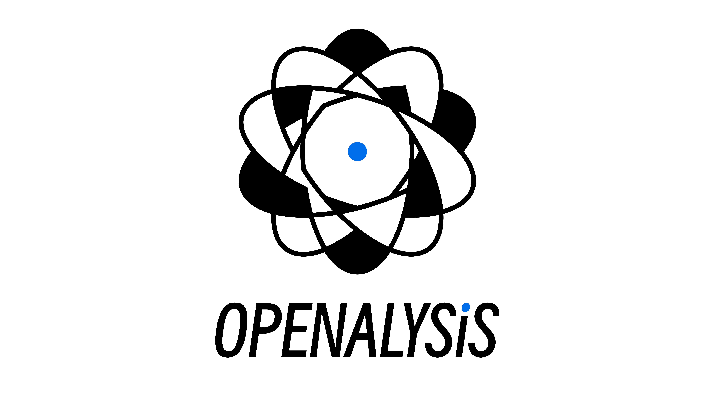
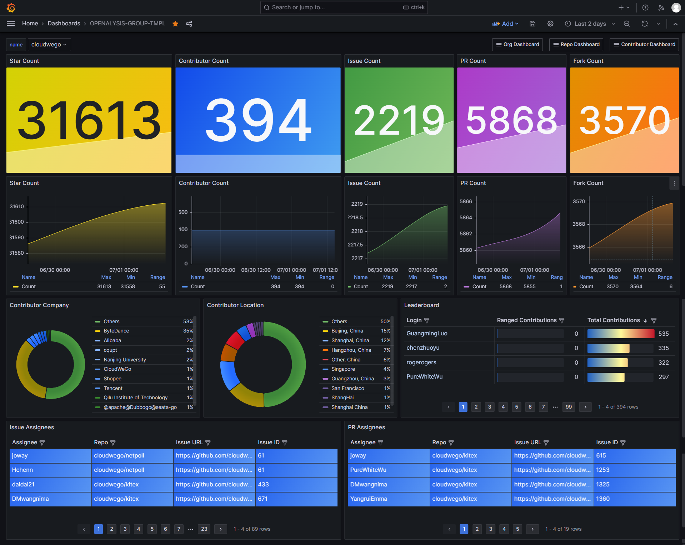
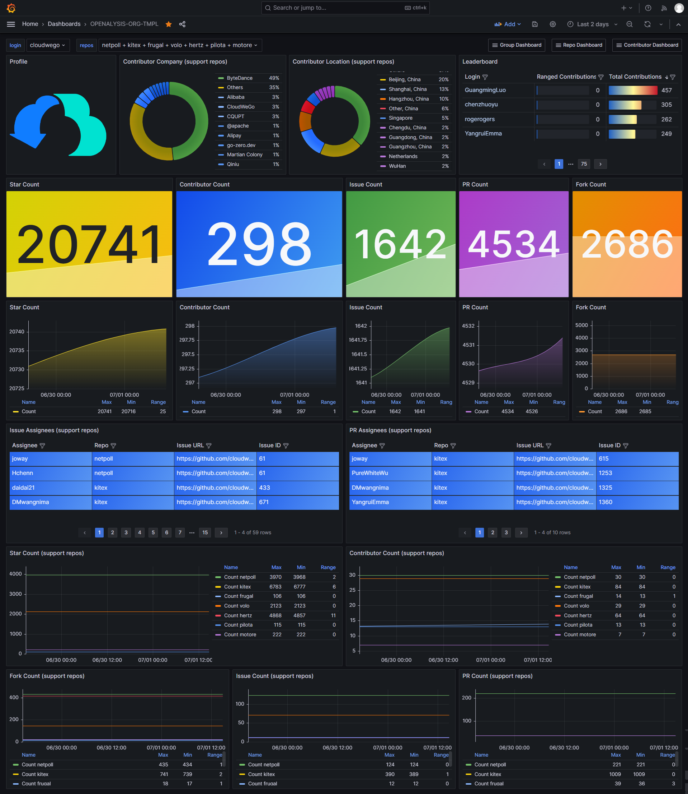
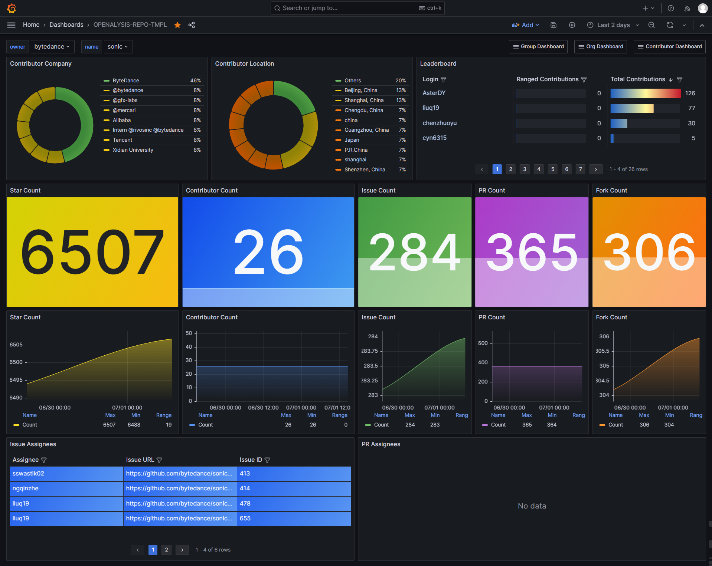
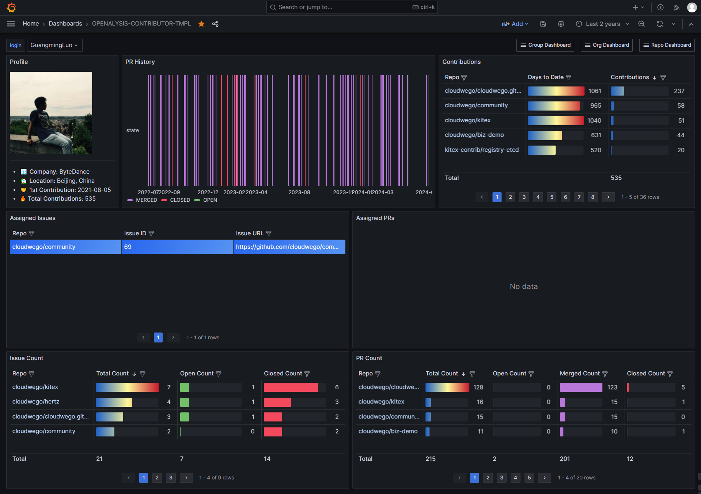

OPENALYSIS is a tool for visualizing and analyzing data from the GitHub open-source community.

## Overview

OPENALYSIS only does three things:

1. Sets up scheduled tasks to retrieve data from configured organizations or repositories via the GitHub API ([REST API](https://docs.github.com/en/rest?apiVersion=2022-11-28) and [GraphQL API](https://docs.github.com/en/graphql)).
2. Organizes and stores the retrieved data in a [MySQL](https://www.mysql.com/) database.
3. Queries the database and visualizes the data in charts and other forms through [Grafana](https://grafana.com/grafana/).

OPENALYSIS provides:

- A series of dynamic Grafana dashboards for visualizing and analyzing data from various dimensions, such as organizations, repositories, contributors, etc.
- A command-line tool to quickly start and restart scheduled tasks.
- A series of APIs to configure and use this tool.

OPENALYSIS gives you an overview of the overall data for the open-source community you manage or belong to. We hope OPENALYSIS can help you better build and develop your open-source community.

## Usage

The operation of OPENALYSIS depends on MySQL and Grafana services. The following documents will help you configure the necessary dependencies and run OPENALYSIS through the command line tool or API.

- [How to deploy?](./docs/how-to-deploy.md)
- [How to prepare config file?](./docs/how-to-prepare-config-file.md)
- [How to use CMD tool?](./docs/how-to-use-cmd-tool.md)
- [How to use API?](./docs/how-to-use-api.md)

## Grafana Dashboard Templates

OPENALYSIS offers four dimensions of Grafana Dashboards: 

- [Group](./template/OPENALYSIS-GROUP-TMPL.json)
- [Org](./template/OPENALYSIS-ORG-TMPL.json)
- [Repo](./template/OPENALYSIS-REPO-TMPL.json)
- [Contributor](./template/OPENALYSIS-CONTRIBUTOR-TMPL.json)
 
Each dashboard provides various forms of visual analysis for the corresponding dimension's data.

### Group Template

In the Group Template, the panels are arranged in the following order from left to right, top to bottom:

- **Star Count:** The total number of stargazers for all Organizations and Repositories in the Group.
- **Contributor Count:** The total number of contributors for all Organizations and Repositories in the Group, with duplicate contributors deduplicated during the count.
- **Issue Count:** The total number of issues for all Organizations and Repositories in the Group.
- **PR Count:** The total number of pull requests for all Organizations and Repositories in the Group.
- **Fork Count:** The total number of forks for all Organizations and Repositories in the Group.
- **Star Count:** A trend chart showing the change in the number of stargazers for all Organizations and Repositories in the Group.
- **Contributor Count:** A trend chart showing the change in the number of contributors for all Organizations and Repositories in the Group, with duplicate contributors deduplicated during the count.
- **Issue Count:** A trend chart showing the change in the number of issues for all Organizations and Repositories in the Group.
- **PR Count:** A trend chart showing the change in the number of pull requests for all Organizations and Repositories in the Group.
- **Fork Count:** A trend chart showing the change in the number of forks for all Organizations and Repositories in the Group.
- **Contributor Company:** A pie chart showing the distribution of companies for contributors in all Organizations and Repositories in the Group.
- **Contributor Location:** A pie chart showing the distribution of locations for contributors in all Organizations and Repositories in the Group.
- **Leaderboard:** A ranking of contributors by the number of contributions in all Organizations and Repositories in the Group, with the `Ranged Contributions` field calculating the difference in contributions within the time range set in the Grafana Dashboard.
- **Issue Assignees:** The OPEN issues with Assignees in all Organizations and Repositories in the Group.
- **PR Assignees:** The OPEN pull requests with Assignees in all Organizations and Repositories in the Group.

### Organization Template

In the Organization Template, the panels are arranged in the following order from left to right, top to bottom:

- **Profile:** Organization avatar.
- **Contributor Company (support repos):** A pie chart showing the distribution of contributors' companies for one or more repositories specified by the `repos` variable.
- **Contributor Location (support repos):** A pie chart showing the distribution of contributors' locations for one or more repositories specified by the `repos` variable.
- **Leaderboard:** A ranking of contributors by the number of contributions in all repositories under the organization, with the `Ranged Contributions` field calculating the difference in contributions within the time range set in the Grafana Dashboard.
- **Star Count:** The total number of stargazers for all repositories under the organization.
- **Contributor Count:** The total number of contributors for all repositories under the organization, with duplicate contributors deduplicated during the count.
- **Issue Count:** The total number of issues for all repositories under the organization.
- **PR Count:** The total number of pull requests for all repositories under the organization.
- **Fork Count:** The total number of forks for all repositories under the organization.
- **Star Count:** A trend chart showing the change in the number of stargazers for repositories under the organization.
- **Contributor Count:** A trend chart showing the change in the number of contributors for all repositories under the organization, with duplicate contributors deduplicated during the count.
- **Issue Count:** A trend chart showing the change in the number of issues for all repositories under the organization.
- **PR Count:** A trend chart showing the change in the number of pull requests for all repositories under the organization.
- **Fork Count:** A trend chart showing the change in the number of forks for all repositories under the organization.
- **Issue Assignees (support repos):** OPEN issues with assigned assignees for one or more repositories specified by the `repos` variable.
- **PR Assignees (support repos):** OPEN pull requests with assigned assignees for one or more repositories specified by the `repos` variable.
- **Star Count (support repos):** A trend chart showing the number of stargazers for one or more repositories specified by the `repos` variable.
- **Contributor Count (support repos):** A trend chart showing the number of contributors for one or more repositories specified by the `repos` variable, with duplicate contributors deduplicated during the count.
- **Fork Count (support repos):** A trend chart showing the number of forks for one or more repositories specified by the `repos` variable.
- **Issue Count (support repos):** A trend chart showing the number of issues for one or more repositories specified by the `repos` variable.
- **PR Count (support repos):** A trend chart showing the number of pull requests for one or more repositories specified by the `repos` variable.

### Repository Template

In the Repository Template, the panels are arranged in the following order from left to right, top to bottom:

- **Contributor Company:** A pie chart showing the distribution of companies among all contributors in the repository.
- **Contributor Location:** A pie chart showing the distribution of locations among all contributors in the repository.
- **Leaderboard:** A ranking of all contributors in the repository based on their number of contributions, where the `Ranged Contributions` field calculates the difference in contributions within the time range set in the Grafana Dashboard.
- **Star Count:** The total number of stargazers in the repository.
- **Contributor Count:** The total number of contributors in the repository, with duplicate contributors deduplicated during the count.
- **Issue Count:** The total number of issues in the repository.
- **PR Count:** The total number of pull requests in the repository.
- **Fork Count:** The total number of forks in the repository.
- **Star Count:** A trend chart showing the change in the number of stargazers in the repository.
- **Contributor Count:** A trend chart showing the change in the number of contributors in the repository, with duplicate contributors deduplicated during the count.
- **Issue Count:** A trend chart showing the change in the number of issues in the repository.
- **PR Count:** A trend chart showing the change in the number of pull requests in the repository.
- **Fork Count:** A trend chart showing the change in the number of forks in the repository.
- **Issue Assignees:** All OPEN issues in the repository that have been assigned to Assignees.
- **PR Assignees:** All OPEN pull requests in the repository that have been assigned to Assignees.

### Contributor Template

In the Contributor Template, the panels are arranged in the following order from left to right, top to bottom:

- **Profile:** Contributor's avatar and other information.
- **PR History:** Contributor's pull requests history.
- **Contributions:** Statistics of the contributor's contributions to each repository.
- **Assigned Issues:** Issues assigned to the contributor.
- **Assigned PRs:** Pull requests assigned to the contributor.
- **Issue Count:** Statistics of issues created by the contributor.
- **PR Count:** Statistics of pull requests created by the contributor.

## Blogs

- [How to Visualize and Analyze Data in Open Source Communities](https://dev.to/justlorain/how-to-visualize-and-analyze-data-in-open-source-communities-1l35)

## Acknowledgement

Sincere appreciation to the [CloudWeGo](https://github.com/cloudwego) community, without whose help this project would not have been possible.

## License

OPENALYSIS is distributed under the [Apache License 2.0](./LICENSE). The licenses of third party dependencies of OPENALYSIS are explained [here](./licenses).

## ECOLOGY

  
OPENALYSIS is a Subproject of the <a href="https://github.com/B1NARY-GR0UP">BINARY WEB ECOLOGY</a>

