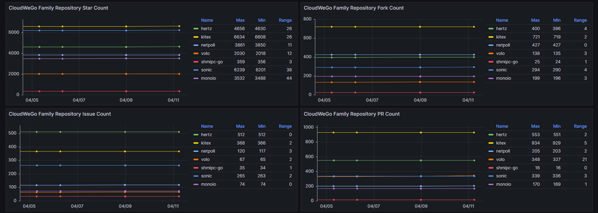

# OPENALYSIS

> You Can (Not) Observe


Open Analysis Service

## Install

- Install CMD Tool

```shell
go install github.com/B1NARY-GR0UP/openalysis@latest
```

- Get Library

```shell
go get -u github.com/B1NARY-GR0UP/openalysis
```

## Usage

```shell
oa start -t "your-token" -c "cron-spec" -r "retry-times" path2config.yaml
```

TODO

## Example




## Related Projects

- [cwg-open-analysis](https://github.com/cloudwego-contrib/cwgo-open-analysis)

## Acknowledgement

Sincere appreciation to the [CloudWeGo](https://github.com/cloudwego) community, without whose help this project would not have been possible.

## License

OPENALYSIS is distributed under the [Apache License 2.0](./LICENSE). The licenses of third party dependencies of OPENALYSIS are explained [here](./licenses).

## ECOLOGY

<p align="center">

<br/><br/>
OPENALYSIS is a Subproject of the <a href="https://github.com/B1NARY-GR0UP">BINARY WEB ECOLOGY</a>
</p>
