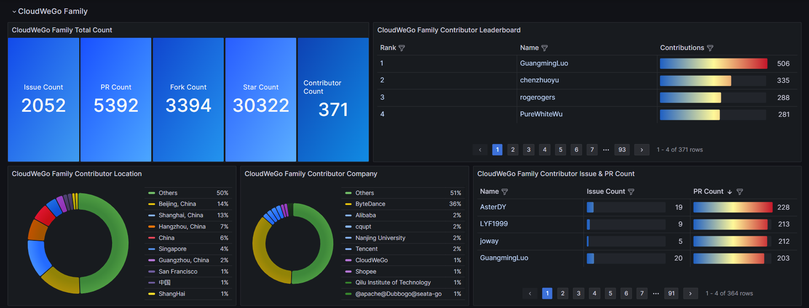
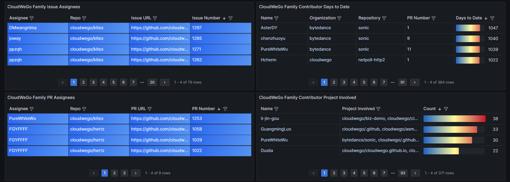

# OPENALYSIS

[](https://goreportcard.com/report/github.com/B1NARY-GR0UP/openalysis)

> You Can (Not) Observe


Open Analysis Service

## Install

- Install CMD Tool

```shell
go install github.com/B1NARY-GR0UP/openalysis@latest
```

- Get Library

```shell
go get -u github.com/B1NARY-GR0UP/openalysis
```

- Do not have a Go environment? Check the [Quick Start](#quick-start) section.

## Usage (CMD Tool)

- **[Start](#start---start-openalysis-service)**: Start OPENALYSIS service
- **[Restart](#restart---restart-openalysis-service)**: Restart OPENALYSIS service

```shell
Usage:        
  openalysis [command]

Available Commands:
  help        Help about any command
  restart     restart openalysis service
  start       start openalysis service

Flags:
  -h, --help      help for openalysis
  -v, --version   version for openalysis
```

**NOTE:**

**1. All configurations are based on the configuration file, and if flags are set, they will override the configurations in the configuration file.**

**2. If the configuration file path is not specified, the project's default configuration file will be used.**

### Start - Start OPENALYSIS service

- **Usage**

```shell
openalysis start [flags] [path2config]
```

- **Flags**

| Short | Long    | Description                                                                                                                                                                            |
|-------|---------|----------------------------------------------------------------------------------------------------------------------------------------------------------------------------------------|
| -t    | --token | [Your GitHub Token](https://docs.github.com/en/authentication/keeping-your-account-and-data-secure/managing-your-personal-access-tokens#creating-a-fine-grained-personal-access-token) |
| -c    | --cron  | Your Cron Spec                                                                                                                                                                         |
| -r    | --retry | Retry Times                                                                                                                                                                            |
| -h    | --help  | Help for Start                                                                                                                                                                         |

- **Example**

```shell
openalysis start -c "@hourly" -r "5" config.yaml
```

### Restart - Restart OPENALYSIS service

- **Usage**

```shell
openalysis restart [flags] [path2config]
```

- **Flags**

| Short | Long    | Description                                                                                                                                                                            |
|-------|---------|----------------------------------------------------------------------------------------------------------------------------------------------------------------------------------------|
| -t    | --token | [Your GitHub Token](https://docs.github.com/en/authentication/keeping-your-account-and-data-secure/managing-your-personal-access-tokens#creating-a-fine-grained-personal-access-token) |
| -c    | --cron  | Your Cron Spec                                                                                                                                                                         |
| -r    | --retry | Retry Times                                                                                                                                                                            |
| -h    | --help  | Help for Restart                                                                                                                                                                       |

- **Example**

```shell
openalysis restart -t "example-github-token"
```

### Sample Configuration File

- **groups**
 
Configure the organization or repository you want to analyze on a group basis. 

You can set up multiple groups, where each group can contain multiple organizations or repositories.

- **datasource**

The configuration for MySQL, will be used as a datasource for Grafana.

- **backend**

The backend configuration for the service includes settings for `cron`, GitHub `token`, and `retry` attempts.

- **cleaner**

The configuration for unifying contributor's location and company information.

```yaml
groups:
  - name: "cloudwego"
    orgs:
      - "cloudwego"
      - "kitex-contrib"
      - "hertz-contrib"
      - "volo-rs"
    repos:
      - "bytedance/sonic"
      - "bytedance/monoio"
datasource:
  mysql:
    host: "mysql"
    port: "3306"
    user: "openalysis"
    password: "openalysis"
    database: "openalysis?charset=utf8&parseTime=True&loc=Local"
backend:
  cron: "@daily"
  token: "your-github-token"
  retry: 3
# "`Before` => `After`"
cleaner:
  - "`@CloudWeGo` => `CloudWeGo`"
  - "`@cloudwego` => `CloudWeGo`"
```

## Quick Start

### Step 1: Create GitHub Token

Create a [fine-grained personal access token](https://docs.github.com/en/authentication/keeping-your-account-and-data-secure/managing-your-personal-access-tokens#creating-a-fine-grained-personal-access-token).

### Step 2: Start Service

- Use Docker-Compose

Config the command in the `openalysis` service.

```shell
docker-compose up --build
```

- Build from Dockerfile

Start your MySQL and Grafana.

```shell
docker build -t openalysis .
```

```shell
docker run -it -v path2config.yaml:/src openalysis start path2config.yaml
```

### Step 3: Config Grafana

1. Visit `127.0.0.1:3000` on browser
2. Add MySQL Datasource
3. Import template in `template` folder

## Dashboard Effect Display






## Blogs

- [How to Visualize and Analyze Data in Open Source Communities](https://dev.to/justlorain/how-to-visualize-and-analyze-data-in-open-source-communities-1l35) | [中文](https://juejin.cn/post/7359882185362948135)

## TODO

- [x] support for marking contributor company manually
- [ ] org, group time series support
- [ ] leaderboard, issue, pr adapt to time range
- [ ] issue, pr number => issue, pr id
- [ ] use dashboard variable to implement personal dashboard display

---

- [ ] parse json to adapt general template
- [ ] cmd tool optimize
- [ ] optimize logger
- [ ] provide more api

## Acknowledgement

Sincere appreciation to the [CloudWeGo](https://github.com/cloudwego) community, without whose help this project would not have been possible.

## License

OPENALYSIS is distributed under the [Apache License 2.0](./LICENSE). The licenses of third party dependencies of OPENALYSIS are explained [here](./licenses).

## ECOLOGY

<p align="center">

<br/><br/>
OPENALYSIS is a Subproject of the <a href="https://github.com/B1NARY-GR0UP">BINARY WEB ECOLOGY</a>
</p>
