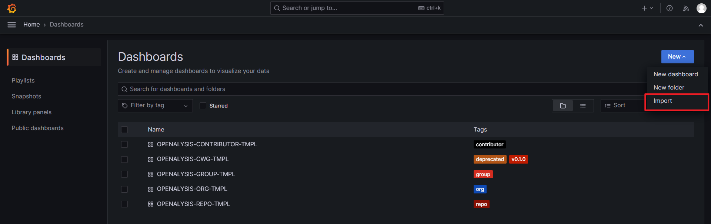

# 如何部署？

## 第一步：创建 GitHub Token

创建一个[精细化的个人访问令牌](https://docs.github.com/en/authentication/keeping-your-account-and-data-secure/managing-your-personal-access-tokens#creating-a-fine-grained-personal-access-token)。

## 第二步：准备配置文件

详细信息请参阅[如何准备配置文件？](./how-to-prepare-config-file-zh.md)。

## 第三步：准备 MySQL

创建名为 `openalysis` 的模式，并使用 [init.sql](../storage/sql/init.sql) 初始化数据库表。

## 第四步：准备 Grafana

1. 添加 OPENALYSIS MySQL 数据源

2. 导入 [template](../template) 文件夹中的模板

## 第五步：启动 OPENALYSIS

- 使用命令行工具启动，请查看详细信息 [如何使用 CMD 工具？](../docs/how-to-use-cmd-tool-zh.md)。
- 使用 API 启动，请查看详细信息 [如何使用 API？](../docs/how-to-use-api-zh.md)。

## 第六步：访问您的仪表板

祝您使用 OPENALYSIS 愉快！