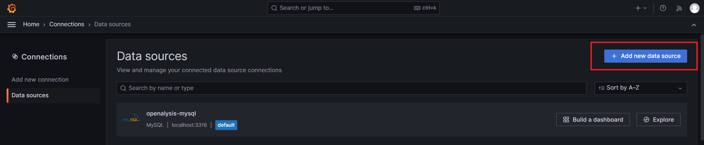
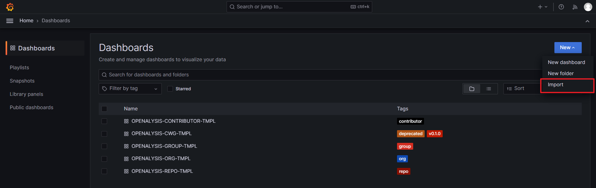

# How to deploy?

## Step 1: Create GitHub Token

Create a [fine-grained personal access token](https://docs.github.com/en/authentication/keeping-your-account-and-data-secure/managing-your-personal-access-tokens#creating-a-fine-grained-personal-access-token).

## Step 2: Prepare Your Configuration File

Check [How to prepare config file?](./how-to-prepare-config-file.md) for detail.

## Step 3: Prepare MySQL

Create a schema named `openalysis` and use [init.sql](../storage/sql/init.sql) to init tables.

## Step 4: Prepare Grafana

1. Add OPENALYSIS MySQL Datasource

 
2. Import template in [template](../template) folder

## Step 5: Start OPENALYSIS

- Use command-line tool to start, check [How to use CMD tool?](../docs/how-to-use-cmd-tool.md) for detail.
- Use API to start, check [How to use API?](../docs/how-to-use-api.md) for detail.

## Step 6: Visit Your Dashboard

Happy OPENALYSIS!
